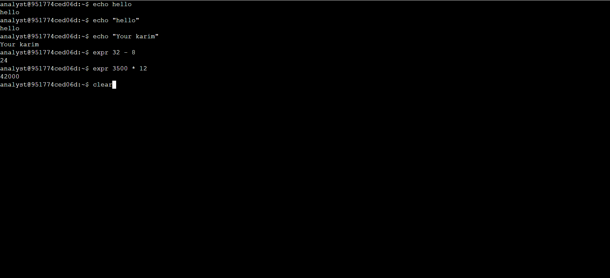

# 🛡️ Cybersecurity Labs

Welcome to my labs repository! Here, I document my hands-on experiments, network analysis, and security room walkthroughs that I perform myself.

## 📁 Repository Sections:
* **Network Security & Traffic Analysis:** Packet analysis labs using Wireshark and tcpdump.
* **TryHackMe Writeups:** Documentation and step-by-step solutions for security rooms (Defensive Operations).
* **Operating Systems & Tools:** Notes and summaries of Kali Linux commands and system security.
---

## 💻 Linux Command Line Interface (CLI) Basics Lab

This lab demonstrates foundational Linux commands executed via the terminal, focusing on text output, arithmetic evaluation, and environment management.

### Lab Screenshot


### 🛠️ Executed Commands Summary

| Command | Usage in Lab | Description | Output |
| :--- | :--- | :--- | :--- |
| **`echo`** | `echo hello` / `echo "Your karim"` | Prints the provided string or text to the standard output. | `hello` / `Your karim` |
| **`expr`** | `expr 32 - 8` | Evaluates arguments as an expression (Subtraction). | `24` |
| **`expr`** | `expr 3500 \* 12` | Evaluates arguments as an expression (Multiplication). | `42000` |
| **`clear`** | `clear` | Clears the terminal screen for a clean workspace. | *Clears Terminal* |
---

# Linux APT Commands Guide

This repository contains a reference guide for managing network security tools using the **APT (Advanced Package Tool)** package manager in Linux.

---

## 📋 Table of Contents
1. [Suricata Commands](#1-suricata-commands)
2. [Tcpdump Commands](#2-tcpdump-commands)
3. [Package Verification](#3-package-verification)
4. [External References](#4-external-references)
### 📁 Full Lab Report & Walkthrough
* 📄 **[Click here to view the complete step-by-step Lab PDF](https://drive.google.com/file/d/1F6mIYlCDk2ctzzdinGAfIPDyiOfYOhxP/view?usp=drivesdk)*

# 📑 Linux Log Analysis & User Auditing Lab Documentation

This repository documents my hands-on experience in navigating the Linux CLI, auditing user permissions, and analyzing server logs for potential security alerts.

## 🛠️ Detailed Lab Tasks & Command Execution

| Task / Objective | Commands Executed | Key Findings & Outputs | Skills Mastered |
| :--- | :--- | :--- | :--- |
| **1. User Directory Auditing**<br>Inspect newly added users and map them to their correct corporate departments. | `cd /home/analyst/reports/users`<br>`ls`<br>`cat Q1_added_users.txt` | • Successfully displayed a structured table of Q1 added users.<br>• Identified critical fields: `employee_id`, `username`, and `department`. | • Linux file system navigation.<br>• Full-text file extraction using `cat`. |
| **2. Server Log Analysis**<br>Inspect log files to identify active system events, warnings, and error messages. | `cd /home/analyst/logs`<br>`ls`<br>`head server_logs.txt` | • Extracted the top lines of `server_logs.txt`.<br>• Discovered regular `info` messages alongside `error` alerts.<br>• Identified `warning` messages regarding disk storage. | • Log review & Incident analysis.<br>• Sifting through large log files efficiently using `head`. |
| 📸 **Lab Execution Screenshot** | *Captured from terminal* |  
| • Evidence-based reporting & verification. |

---

## 💡 Quick Command Reference
* `cd` - Change directory (Navigating absolute and relative paths).
* `ls` - List directory contents (Discovering files and folders).
* `cat` - Concatenate (Displaying entire text file content).
* `head` - Top lines extractor (Viewing the first 10 rows of a file to save analytical time).

# Linux File Management and Log Analysis Lab

## 🎯 Objective
The objective of this lab is to practice navigating the Linux file system, inspecting user reports, and analyzing system log files using core CLI tools (`cd`, `ls`, `grep`, and `|`).

---

## 💻 Lab Steps & Execution Reference

| Step | Objective | Command Executed | Key Outputs / Insights |
| :--- | :--- | :--- | :--- |
| **1** | Navigate to logs directory and analyze server logs | `cd logs`<br>`grep error server_logs.txt` | Identified multiple critical errors including:<br>• `The password is incorrect`<br>• `The username is incorrect`<br>• `Unauthorized access` |
| **2** | Change directory to user reports | `cd /home/analyst/reports/users` | Successfully moved to the targeted directory for quarter reports. |
| **3** | Filter files for the first quarter (Q1) | `ls \| grep Q1` | Isolated Q1 files:<br>• `Q1_access.txt`<br>• `Q1_added_users.txt`<br>• `Q1_deleted_users.txt` |
| **4** | Filter all access logs across all quarters | `ls \| grep access` | Successfully isolated access reports for all quarters (`Q1_access.txt` through `Q4_access.txt`). |
| **5** | List all files in the current directory | `ls` | Displayed the complete structure of all quarterly text files (`added_users`, `deleted_users`, `access`). |
| **6** | Audit a specific deleted user | `grep jhill Q2_deleted_users.txt` | Found user **jhill** (ID: `1025`) under the `Sales` department. |
| **7** | Filter new additions by department | `grep "Human Resources" Q4_added_users.txt` | Extracted HR personnel added in Q4:<br>• `1151 sshah Human Resources`<br>• `1145 msosa Human Resources` |

---

## 🛠️ Extracted Log Data Summaries

### 🔍 Server Log Security Events (`server_logs.txt`)
| Timestamp | Event Type | Description / Message |
| :--- | :--- | :--- |
| `2022-09-28 13:56:22` | `error` | The password is incorrect |
| `2022-09-28 15:56:22` | `error` | The username is incorrect |
| `2022-09-28 16:56:22` | `error` | The password is incorrect |
| `2022-09-29 13:56:22` | `error` | An unexpected error occurred |
| `2022-09-29 15:56:22` | `error` | Unauthorized access |
| `2022-09-29 16:56:22` | `error` | Unauthorized access |

### 👥 Targeted User Queries
| Target Query | Source File | Extracted Record Details |
| :--- | :--- | :--- |
| `jhill` | `Q2_deleted_users.txt` | `1025   jhill   Sales` |
| `"Human Resources"` | `Q4_added_users.txt` | `1151   sshah   Human Resources`<br>`1145   msosa   Human Resources` |

---

## 🚀 Skills Demonstrated
* **Log Analysis & Threat Hunting:** Filtering system events to detect unauthorized access and authentication failures.
* **Data Filtering & Pipeline Usage:** Employing pipes (`|`) and `grep` regex targeting to parse unstructured text files rapidly.
* **System Administration:** Efficient navigation and directory mapping via the Linux CLI.

 # Linux File and Directory Management Lab

## Overview
This practical lab demonstrates essential Linux command-line operations for managing files and directories. The tasks include creating, moving, listing, and deleting files and directories within a Linux environment, simulated as an IT Security Analyst.

## Objectives
* Create and remove directories to maintain an organized file system.
* Navigate between absolute and relative directory paths.
* Move and manage report files across folders.
* Create and delete temporary documentation files securely.

## Commands Used
* `mkdir`: Create a new directory.
* `rmdir`: Remove an empty directory.
* `ls`: List directory contents.
* `cd`: Change the current working directory.
* `mv`: Move or rename files and directories.
* `rm`: Remove files.
* `touch`: Create a new empty file.

---

## Lab Walkthrough & Execution

| Step | Description | Commands Executed |
| :---: | :--- | :--- |
| **1** | **Directory Creation & Cleanup:**<br>Initialized a new directory named `logs` for structured log management, listed the directory layout, and removed an unneeded temporary empty directory named `temp`. | `mkdir logs`<br>`ls`<br>`rmdir temp`<br>`ls` |
| **2** | **Navigation & File Relocation:**<br>Navigated to the notes directory using the absolute path `/home/analyst/notes`. Moved the quarterly patch report `Q3patches.txt` into the designated `reports` folder. | `cd /home/analyst/notes`<br>`mv Q3patches.txt /home/analyst/reports/`<br>`ls`<br>`ls /home/analyst/reports` |
| **3** | **File Cleanup & Task Initialization:**<br>Permanently deleted the stale temporary note file `tempnotes.txt`, and initialized a fresh tracking file named `tasks.txt` to log upcoming duties. | `rm tempnotes.txt`<br>`ls`<br>`touch tasks.txt`<br>`ls` |

---

## Lab Proof & Verification

### Terminal Evidence
Below is the terminal capture verifying that all file management workflows, directory structures, and system cleanup commands were completed successfully without errors:


# Linux File Permissions & Access Control Lab

## Overview
This lab demonstrates how to manage and audit file and directory permissions in a Linux environment using the `chmod` command. The objective was to secure sensitive project files by restricting unauthorized read, write, and execute access for different user categories (Owner, Group, and Others).

## Lab Objectives
* Analyze existing file permissions using `ls -l` and `ls -la`.
* Modify permissions for specific users, groups, and others using symbolic notation.
* Secure hidden configuration files and directories.

---

## Tasks & Commands Executed

Based on the lab session captured in `0685821a-d46f-464b-9322-a6ae5b40343e`:

### 1. Auditing Directory Contents
* Used `ls -l` to list standard files and `ls -la` to reveal hidden files (like `.project_x.txt`).

### 2. Restricting "Others" Access
* **Command:** `chmod o-w project_k.txt`
* **Purpose:** Removed write (`w`) permission for others (`o`) from `project_k.txt` to prevent unauthorized modifications.

### 3. Restricting "Group" Access
* **Command:** `chmod g-r project_m.txt`
* **Purpose:** Removed read (`r`) permission for the group (`g`) from `project_m.txt` to ensure confidentiality within the team.

### 4. Securing Hidden Files
* **Command:** `chmod u-w,g-w,g+r .project_x.txt`
* **Purpose:** Modified permissions on the hidden file `.project_x.txt` to revoke write access from the owner and group, while ensuring the group has read access.

### 5. Securing Directories
* **Command:** `chmod g-x drafts`
* **Purpose:** Removed execute (`x`) permission from the `drafts` directory for group members, preventing them from entering or traversing the directory.

---

## Skills Learned
* **Linux CLI Navigation:** Efficient use of file listing flags (`-l`, `-a`).
* **Access Control:** Implementing the principle of least privilege by stripping unnecessary permissions.
* **Security Auditing:** Identifying over-permissive files and remediating them instantly.
*

# Linux User, Group, and Ownership Management Lab

## Overview
This lab focuses on user account administration, group management, and modifying file ownership within a Linux system. Managing these elements is crucial for enforcing security policies, managing privileges, and ensuring proper access control across shared environments.

## Lab Objectives
* Create and delete user accounts securely using administrative privileges (`sudo`).
* Modify user group affiliations (both primary and secondary groups).
* Change file ownership to restrict or grant specific user access.
* Clean up residual groups after user deletion.

---

## Tasks & Commands Executed

Based on the lab session captured in `ecd16ec9-37a3-4339-a721-67a0930e422e`:

### 1. Creating a New User
* **Command:** `sudo useradd researcher9`
* **Purpose:** Created a new standard user account named `researcher9`.

### 2. Managing Group Affiliations
* **Primary Group:** `sudo usermod -g research_team researcher9`
  * *Purpose:* Changed the primary group of `researcher9` to `research_team`.
* **Secondary Group:** `sudo usermod -aG sales_team researcher9`
  * *Purpose:* Appended (`-aG`) the user to a secondary group named `sales_team` without removing them from their primary group.

### 3. Changing File Ownership
* **Command:** `sudo chown researcher9 /home/researcher2/projects/project_r.txt`
* **Purpose:** Transferred the ownership (`chown`) of `project_r.txt` to `researcher9`, granting them owner-level privileges over that specific file.

### 4. User and Group Deletion (Cleanup)
* **Command:** `sudo userdel researcher9`
  * *System Response:* The system notified that the group `researcher9` was not automatically removed because it wasn't the user's primary group at the time of deletion.
* **Command:** `sudo groupdel researcher9`
  * *Purpose:* Manually deleted the residual `researcher9` group to maintain a clean system configuration and avoid orphaned groups.

---

## Skills Learned
* **User Lifecycle Management:** Creating, modifying, and safely deleting user accounts.
* **Access Control & Ownership:** Applying the concept of file ownership (`chown`) to control asset access.
* **System Hygiene:** Handling warnings during user deletion and manually removing leftover groups to prevent configuration drift.
*

# Linux System Administration & Commands Reference

A comprehensive technical reference documentation for essential Linux commands, configuration files, and system management utilities based on system manual (`man`) pages.

---

## 1. System Documentation & Command Discovery Utilities

These utilities are the primary built-in tools used to navigate system documentation, search for specific commands, or find their purposes directly from the terminal.

### The Core Help Utilities
* **`man`**: The primary interface used to view the system's reference manuals. It provides complete, exhaustive documentation for any command, including syntax, deep descriptions, options, affected files, and exit values.
* **`whatis`**: Displays a one-line manual page description to give a quick overview of what a command does.
  * *Example*: `whatis cat` outputs "concatenate files and print on the standard output".
* **`apropos`**: Searches the manual page descriptions for specific keywords when the exact command name is unknown.
  * *Example*: `apropos a first part file` helps locate the `head (1)` command.
  * *Example*: `apropos create new group` helps locate the `groupadd (8)` command.

### Quick Comparison Matrix

| Utility | Best Used When... | Expected Output Type |
| :--- | :--- | :--- |
| **`man [command]`** | You know the command but need **full, detailed instructions** and all flags. | A comprehensive, multi-page scrollable manual. |
| **`whatis [command]`** | You know the command name but just need a **one-line reminder** of its role. | A single, short descriptive sentence. |
| **`apropos [keyword]`** | You **don't know the command name** and want to search by its meaning/action. | A curated list of matching commands and tools. |

---

## 2. File & Directory Management

### `cat` — Concatenate files and print on the standard output
* **Synopsis**: `cat [OPTION]... [FILE]...`
* **Description**: Concatenates file(s) to standard output. If no file is specified, it reads from the standard input.
* **Key Options**:
  * `-n`, `--number`: Numbers all output lines.
  * `-b`, `--number-nonblank`: Numbers nonempty output lines (overrides `-n`).
  * `-e`: Equivalent to `-vE`.
  * `-E`, `--show-ends`: Displays a `$` character at the end of each line.
  * `-s`, `--squeeze-blank`: Suppresses repeated empty output lines.
  * `-t`: Equivalent to `-vT`.
  * `-T`, `--show-tabs`: Displays TAB characters as `^I`.
  * `-v`, `--show-nonprinting`: Uses `^` and `M-` notation, except for LFD and TAB.

### Other Core File Commands
* **`head (1)`**: Outputs the first part of files.
* **`rm (1)`**: Removes files or directories.
* **`rmdir (1, 2)`**: Removes empty directories or deletes a directory.

---

## 3. User & Group Account Management

### `useradd` — Create a new user or update default new user information
* **Synopsis**: 
  * `useradd [options] LOGIN`
  * `useradd -D [options]` (to view or change default values)
* **Description**: A low-level utility for adding users. On Debian systems, administrators should usually use `adduser (8)` instead.

#### Primary Creation Options:
* `-m`, `--create-home`: Creates the user's home directory if it does not exist, copying initial files from the skeleton directory.
* `-M`, `--no-create-home`: Explicitly forces `useradd` not to create the home directory, even if the system-wide setting (`CREATE_HOME`) in `/etc/login.defs` is set to yes.
* `-d`, `--home-dir HOME_DIR`: Specifies a custom login directory name. The directory does not have to exist and won't be created if it is missing unless combined with `-m`.
* `-b`, `--base-dir BASE_DIR`: Defines the default base directory prefix for the system if `HOME_DIR` is not specified (concatenates `BASE_DIR + LOGIN`). Defaults to `/home`.
* `-c comment`: Adds a short description or text string, generally used as the field for the user's full name.
* `-e EXPIRE_DATE`: The specific date on which the user account will be disabled, formatted as `YYYY-MM-DD`.
* `-f INACTIVE`: Number of days after a password expires until the account is permanently disabled (`0` disables immediately, `-1` disables the feature).
* `-g GROUP`: Sets the primary group name or GID for the new user.
* `-G GROUP1,GROUP2`: A comma-separated list of supplementary groups that the user is also a member of, with no intervening whitespace.
* `-s SHELL`: Defines the name of the user's custom login shell.
* `-u UID`: Sets a specific numerical value for the user's ID. Must be unique unless combined with the `-o` option.
* `-o`, `--non-unique`: Allows the creation of a user account with a duplicate (non-unique) UID (valid only with `-u`).
* `-r`, `--system`: Creates a system account with no password aging information in `/etc/shadow` and assigns a UID within the system range.

### `groupadd` — Create a new group
* **Description**: Creates an entirely new group account in the system using the specified configurations.

---

## 4. System Files & Configurations Affected

System account management commands read and write to several critical configuration files:

* **`/etc/passwd`**: Stores core user account information.
* **`/etc/shadow`**: Holds secure, encrypted user account information and password details.
* **`/etc/group`**: Contains group account definitions.
* **`/etc/gshadow`**: Holds secure group account details.
* **`/etc/default/useradd`**: Stores the system-wide default values used during account creation.
* **`/etc/skel/`**: Directory containing default configuration files copied into a new user's home directory when created.
* **`/etc/login.defs`**: Configuration file for the shadow password suite, defining properties like UID ranges, home directory permissions, and password aging policies.

---

## 5. Command Exit Values (Status Codes)

When executing `useradd`, the tool returns specific exit codes depending on the result:
* **`0`**: Success
* **`1`**: Can't update password file
* **`3`**: Invalid argument to option
* **`4`**: UID already in use (and no `-o` provided)
* **`6`**: Username already in use
* **`9`**: Can't update group file
* **`10`**: Can't create home directory
* **`12`**: Can't update SELinux user mapping
*[System Administration & Commands Reference.pdf](https://github.com/user-attachments/files/28429589/System.Administration.Commands.Reference.pdf)
# 🔍 Lab: Querying Log-In Attempts Using SQL Filters

## 📌 Project Overview
In this security audit lab, I used **MariaDB (SQL)** to investigate and filter system access logs from the `log_in_attempts` table. The goal was to isolate specific security events based on dynamic conditions like timestamps, specific date ranges, and hourly boundaries to identify potentially anomalous behavior.

---

## 🛠️ Skills Demonstrated
*   **Database Management:** Querying structured data within MariaDB.
*   **SQL Filtering & Logic:** Utilizing `WHERE`, `BETWEEN`, and relational operators (`>`, `<`).
*   **Security Auditing:** Filtering system logs to analyze user login patterns and potential unauthorized access.

---

# 🔍 Lab: Querying Log-In Attempts Using SQL Filters

## 📌 Project Overview
In this security audit lab, I used **MariaDB (SQL)** to investigate and filter system access logs from the `log_in_attempts` table. The goal was to isolate specific security events based on dynamic conditions like timestamps, specific date ranges, and hourly boundaries to identify potentially anomalous behavior.

---

## 🛠️ Skills Demonstrated
*   **Database Management:** Querying structured data within MariaDB.
*   **SQL Filtering & Logic:** Utilizing `WHERE`, `BETWEEN`, and relational operators (`>`, `<`).
*   **Security Auditing:** Filtering system logs to analyze user login patterns and potential unauthorized access.

---

# 🔍 Lab: Querying Log-In Attempts Using SQL Filters

## 📌 Project Overview
In this security audit lab, I used **MariaDB (SQL)** to investigate and filter system access logs from the `log_in_attempts` table. The goal was to isolate specific security events based on dynamic conditions like timestamps, specific date ranges, and hourly boundaries to identify potentially anomalous behavior.

---

## 🛠️ Skills Demonstrated
- **Database Management:** Querying structured data within MariaDB.
- **SQL Filtering & Logic:** Utilizing `WHERE`, `BETWEEN`, and relational operators (`>`, `<`).
- **Security Auditing:** Filtering system logs to analyze user login patterns and potential unauthorized access.

---

🔐 Querying Log-In Attempts Using SQL Filters
A cybersecurity project demonstrating how to use SQL queries with filters to investigate suspicious login activity and support security audits.

📋 Project Overview
This project showcases practical SQL skills applied to a real-world security scenario: analyzing a log_in_attempts table to identify unusual or potentially malicious login behavior.
The queries use filtering techniques such as WHERE, AND, OR, NOT, BETWEEN, and comparison operators to extract meaningful insights from raw login data.

🗄️ Database Structure
Table: log_in_attempts
ColumnTypeDescriptionevent_idINTUnique identifier for each login eventusernameVARCHARThe user who attempted to log inlogin_dateDATEDate of the login attemptlogin_timeTIMETime of the login attemptcountryVARCHARCountry of origin (e.g. US, MEX, CAN)ip_addressVARCHARIP address of the login attemptsuccessBOOLEAN1 = successful login, 0 = failed

🔍 Queries & Filters Applied
1. Filter by date — after a specific date
sqlSELECT * FROM log_in_attempts
WHERE login_date > '2022-05-09';

Returns all login attempts that occurred after May 9, 2022 (125 rows).


2. Filter by date — on or after a date
sqlSELECT * FROM log_in_attempts
WHERE login_date >= '2022-05-09';

Includes May 9 itself (165 rows).


3. Filter by date range — BETWEEN
sqlSELECT * FROM log_in_attempts
WHERE login_date BETWEEN '2022-05-09' AND '2022-05-11';

Returns logins across a 3-day window (123 rows).


4. Filter by time — before 7:00 AM
sqlSELECT * FROM log_in_attempts
WHERE login_time < '07:00:00';

Flags early-morning login attempts, which may indicate suspicious activity (67 rows).


5. Filter by time range — between 6 AM and 7 AM
sqlSELECT * FROM log_in_attempts
WHERE login_time BETWEEN '06:00:00' AND '07:00:00';

Narrows down to a specific hour window (15 rows).


6. Filter by event ID — greater than or equal to 100
sqlSELECT event_id, username, login_date
FROM log_in_attempts
WHERE event_id >= 100;

Retrieves a subset of columns for events with IDs 100 and above (101 rows).


7. Filter by event ID range — BETWEEN with column selection
sqlSELECT event_id, username, login_date
FROM log_in_attempts
WHERE event_id BETWEEN 100 AND 150;

Returns exactly 51 rows in the specified ID range.


🛡️ Skills Demonstrated

Writing SQL SELECT statements with targeted column selection
Using WHERE clauses with comparison operators (>, >=, <, <=)
Applying BETWEEN for range-based filtering on both dates and times
Filtering login records to support security investigations
Identifying off-hours access patterns as part of threat detection


🧰 Tools Used

MariaDB (MySQL-compatible)
SQL command-line interface
Database: organization


📌 Use Case
This type of analysis is commonly used by security analysts to:

Detect brute-force attacks (many failed logins)
Identify after-hours access by internal or external actors
Support incident response investigations
Generate audit logs for compliance reporting


👤 Author

Replace this section with your name and LinkedIn/portfolio link.


📄 License
This project is for educational purposes as part of a cybersecurity portfolio.

[Querying Log-In Attempts Using SQL Filters.pdf](https://github.com/user-attachments/files/28654705/Querying.Log-In.Attempts.Using.SQL.Filters.pdf)

# Lab: Classic & Symmetric Decryption (Incident Response Scenario)

## 📌 Project Overview
In this lab, I simulated an incident response scenario where user data was encrypted by a malicious actor. The objective was to investigate the directory, locate hidden clues, decrypt a classic cipher (Caesar Cipher), and utilize the recovered cryptographic key to decrypt a file encrypted with symmetric encryption (AES-256).

## 🛡️ Skills Demonstrated
* **Linux Command Line Proficiency** (`cd`, `ls -a`, `cat`, pipes `|`)
* **Cryptography Analysis** (Caesar Cipher, ROT/Shift decryption using `tr`)
* **Symmetric Decryption** (Using OpenSSL with AES-256-CBC)
* **Incident Response & Data Recovery**

---

## 💻 Step-by-Step Walkthrough

### Step 1: Initial Investigation
Upon inspecting the home directory, I found a `README.txt` stating that all data had been encrypted and directed me to a hidden file within the `caesar` subdirectory.

```bash
cat README.txt
# Output: "All of your data has been encrypted. To recover your data, you will need to solve a cipher..."

cd caesar
ls -a
cat .leftShift3
cat .leftShift3 | tr "d-za-cd-ZA-C" "a-zA-Z"
cd ~
openssl aes-256-cbc -pbkdf2 -a -d -in Q1.encrypted -out Q1.recovered -k ettubrute
cat Q1.recovered

